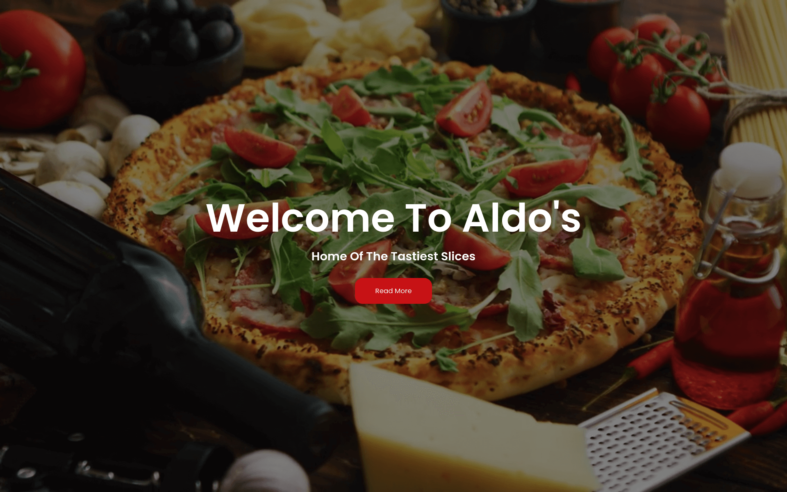

# Aldo's Pizza



### By: Samuel Martins

## Table of Content

-   [Description](#description)
-   [Installation Requirement](#usage)
-   [Technology Used](#technologies)
-   [Licence](#licence)
-   [Authors Info](#author-info)

## Description

This is a simple webapp on which users can come an place an pizza order. It uses the basics of object oriented programming.[live site](https://thesmartcoder7.github.io/aldos-pizza/)

## Behaviour Driven Development 
The user is able to;
- Choose the size of pizza they want e.g Small, Medium, Large

- Choose what kind of crust they would like the pizza to have e.g Crispy, Stuffed, Gluten-free

- Choose the topping(s) they want on my pizza.

- Place an order for my Pizza and see the total charge for it.

- Have an option to order as many pizzas as they want.

- Have an option to have the pizza delivered or not.  If delivered the user is alerted of how much the delivery charge will be.

- Enter where the delivery should be made and then gets an alert saying  "your order will be delivered to your location"

- See a checkout button that when clicked shows the total amount charged for the orders.

## Usage

### Requirements

-   Either a computer, phone, tablet or an Ipad

-   An access to the Internet

### 1. Local Repository

-   Make sure you have a stable internet to have the ability to clone the repository.
-   Type the following command in your terminal to clone this repository

```
git clone https://github.com/thesmartcoder7/aldos-pizza.git
```

If you are using SSH, use the following command

```
git clone git@github.com:thesmartcoder7/aldos-pizza.git
```

When you run the commands successfully, you should have a local version of this repository.

### 2. Online Repository

-   Make sure you have a stable internet for forking this repository.
-   According to the license, you can fork this project. You need to click on the forking icon and it will be added as one of your repositories

Feel free to fork the project and have fun with it. Happy coding!

## Technologies

-   HTML5
-   CSS3
-   JavaScript

## Licence

Copyright (c) Samuel Martins - [MIT Licence](LICENSE)

## Author Info

-   Twitter - [@thesmartcoder7](https://twitter.com/thesmartcoder7)
-   Linkedin - [Samuel Martins](https://www.linkedin.com/in/samuel-martins-09839b115/)
-   Website - [Samuel Martins](https://smart-code.dev)
-   blog - [Samuel Martins](https://samuel-martins.medium.com/)
